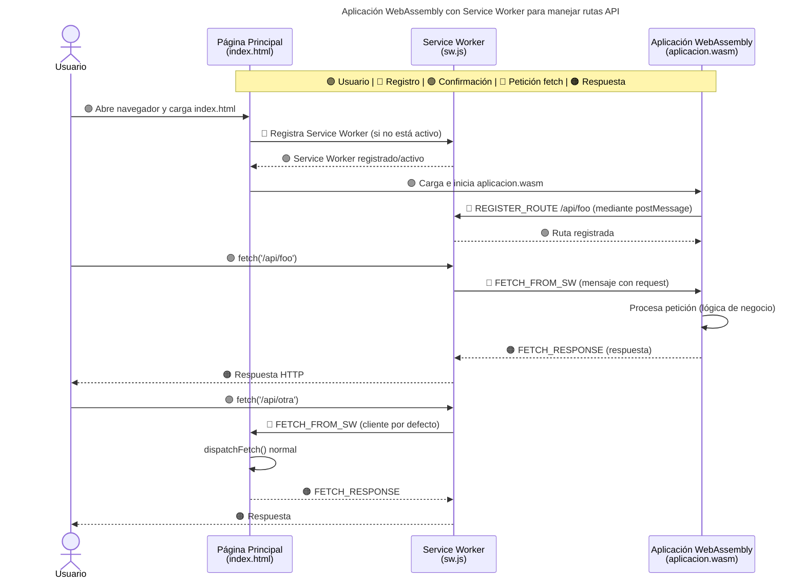

# SDK
Kit de Desarrollo de Software (SDK) escrito en lenguaje Golang, diseñado para facilitar el desarrollo de aplicaciones en C, Assembly y Golang.

> ⚠️ **Advertencia:** Este SDK requiere conocimientos en gestión de memoria en lenguaje C.  
> Si no sabés qué variables deben ser liberadas manualmente (por ejemplo, con `free()`), **no uses este SDK.**  
> El uso incorrecto puede provocar fugas de memoria, corrupción de datos o comportamiento indefinido en tiempo de ejecución.

🛡️ Si no querés lidiar con el manejo de memoria a bajo nivel, puedés usar el SDK en lenguaje Golang de manera segura.  
✅ Los ejemplos han sido testeados para garantizar que no presenten fugas de memoria.  

--- 

### 📦 Requisitos minimos:

| Linux/BSD/MacOS | Windows |
| --- | --- |
| Make 4.3 | cmd 10.0.26100.1742 |
| GCC 11.4.0 | GCC 13.2.0 |
| Golang 1.24.1 | Golang 1.24.1 |
| Git 2.34.1 | Git 2.49.0 |

### ⚙️ Instalación y Compilación

```bash
git clone https://github.com/IngenieroRicardo/SDK.git
cd SDK
make sdk
```

### 🛠️ Compilar main.c

```bash
make compile
```

### 🚀 Ejecutar main.bin

```bash
make run
```

### 🔧 Arquitectura de WebService en Web Assembly

```bash
go run gitlab.com/RicardoValladares/server@latest "ejemplos/web assembly/" 8080
```



