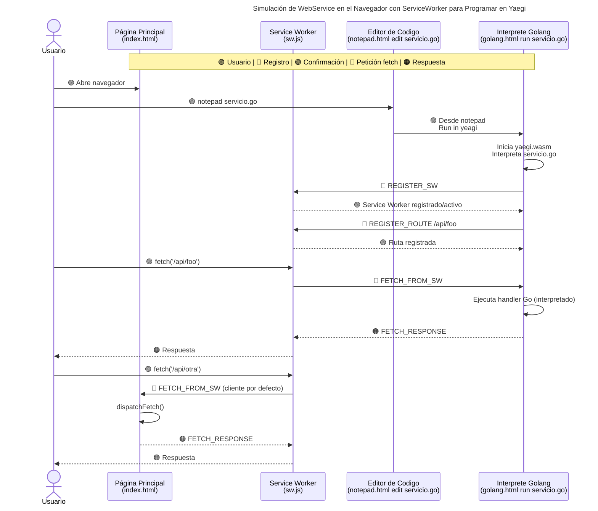

```mermaid
sequenceDiagram
    title Simulación de WebService en el Navegador con ServiceWorker para Programar en Yaegi

    actor Usuario
    participant Main as Página Principal<br/>(index.html)
    participant SW as Service Worker<br/>(sw.js)
    participant Notepad as Editor de Codigo<br/>(notepad.html edit servicio.go)
    participant Golang as Interprete Golang<br/>(golang.html run servicio.go)

    Note over Main,Golang: 🟣 Usuario | 🔵 Registro | 🟢 Confirmación | 🔴 Petición fetch | 🟠 Respuesta

    Usuario->>Main: 🟣 Abre navegador

    Usuario->>Notepad: 🟣 notepad servicio.go
    Notepad->>Golang: 🟣 Desde notepad<br/>Run in yeagi
    Golang->>Golang: Inicia yaegi.wasm<br/>Interpreta servicio.go
    Golang->>SW: 🔵 REGISTER_SW
    SW-->>Golang: 🟢 Service Worker registrado/activo
    Golang->>SW: 🔵 REGISTER_ROUTE /api/foo
    SW-->>Golang: 🟢 Ruta registrada

    Usuario->>SW: 🟣 fetch('/api/foo')
    SW->>Golang: 🔴 FETCH_FROM_SW
    Golang->>Golang: Ejecuta handler Go (interpretado)
    Golang-->>SW: 🟠 FETCH_RESPONSE
    SW-->>Usuario: 🟠 Respuesta

    Usuario->>SW: 🟣 fetch('/api/otra')
    SW->>Main: 🔴 FETCH_FROM_SW (cliente por defecto)
    Main->>Main: dispatchFetch()
    Main-->>SW: 🟠 FETCH_RESPONSE
    SW-->>Usuario: 🟠 Respuesta

```