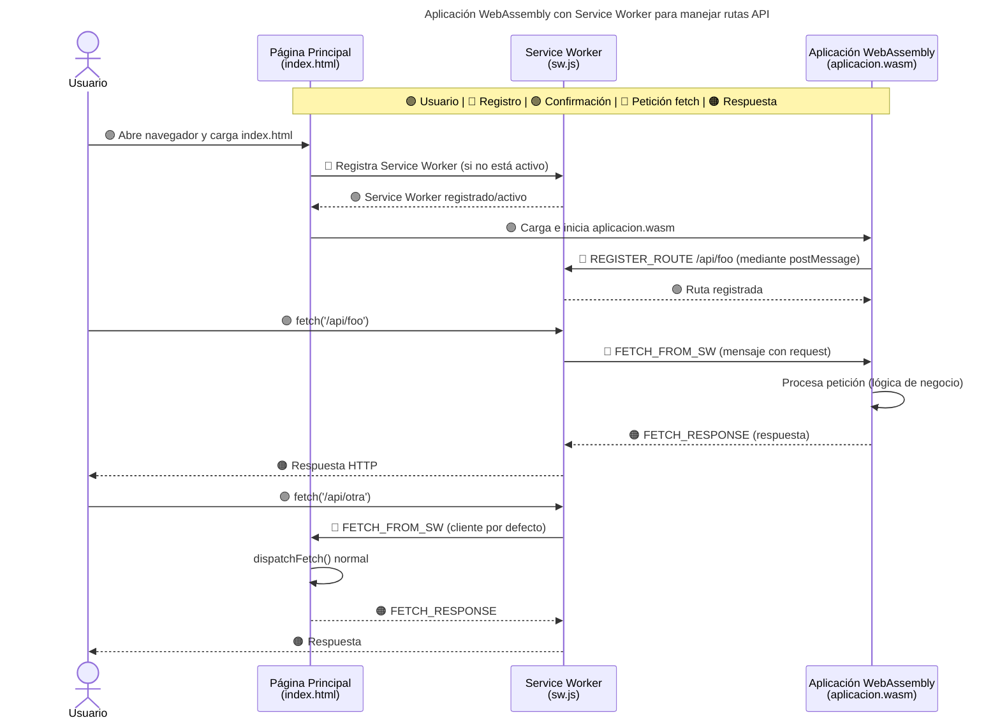

```mermaid
sequenceDiagram
    title Aplicación WebAssembly con Service Worker para manejar rutas API

    actor Usuario
    participant Main as Página Principal<br/>(index.html)
    participant SW as Service Worker<br/>(sw.js)
    participant WASM as Aplicación WebAssembly<br/>(aplicacion.wasm)

    Note over Main,WASM: 🟣 Usuario | 🔵 Registro | 🟢 Confirmación | 🔴 Petición fetch | 🟠 Respuesta

    Usuario->>Main: 🟣 Abre navegador y carga index.html
    Main->>SW: 🔵 Registra Service Worker (si no está activo)
    SW-->>Main: 🟢 Service Worker registrado/activo
    Main->>WASM: 🟣 Carga e inicia aplicacion.wasm
    WASM->>SW: 🔵 REGISTER_ROUTE /api/foo (mediante postMessage)
    SW-->>WASM: 🟢 Ruta registrada

    Usuario->>SW: 🟣 fetch('/api/foo')
    SW->>WASM: 🔴 FETCH_FROM_SW (mensaje con request)
    WASM->>WASM: Procesa petición (lógica de negocio)
    WASM-->>SW: 🟠 FETCH_RESPONSE (respuesta)
    SW-->>Usuario: 🟠 Respuesta HTTP

    Usuario->>SW: 🟣 fetch('/api/otra')
    SW->>Main: 🔴 FETCH_FROM_SW (cliente por defecto)
    Main->>Main: dispatchFetch() normal
    Main-->>SW: 🟠 FETCH_RESPONSE
    SW-->>Usuario: 🟠 Respuesta
```
